# claude-prompts-library

A curated collection of production-ready prompts for coding, writing, analysis, and DevOps tasks. Each prompt includes a system prompt, template, variations, and usage guidance.

## Architecture

```mermaid
flowchart TD
    A[Prompt Library] --> B[Coding]
    A --> C[Writing]
    A --> D[Analysis]
    A --> E[DevOps]
    A --> F[Templates]

    B --> B1[Code Review]
    B --> B2[Debugging]
    B --> B3[Refactoring]

    C --> C1[Technical Docs]
    C --> C2[Blog Posts]

    D --> D1[Data Analysis]
    D --> D2[Security Audit]

    E --> E1[Incident Response]
    E --> E2[Runbook Generation]

    F --> F1[System Prompt]
    F --> F2[Few-Shot]

    style A fill:#2ECC71,stroke:#1A9B52,color:#FFFFFF
    style B fill:#3498DB,stroke:#2476AB,color:#FFFFFF
    style C fill:#E74C3C,stroke:#B83A2F,color:#FFFFFF
    style D fill:#F39C12,stroke:#C47F0E,color:#FFFFFF
    style E fill:#9B59B6,stroke:#7A3D94,color:#FFFFFF
    style F fill:#1ABC9C,stroke:#148F77,color:#FFFFFF
    style B1 fill:#5DADE2,stroke:#3498DB,color:#FFFFFF
    style B2 fill:#5DADE2,stroke:#3498DB,color:#FFFFFF
    style B3 fill:#5DADE2,stroke:#3498DB,color:#FFFFFF
    style C1 fill:#EC7063,stroke:#E74C3C,color:#FFFFFF
    style C2 fill:#EC7063,stroke:#E74C3C,color:#FFFFFF
    style D1 fill:#F5B041,stroke:#F39C12,color:#FFFFFF
    style D2 fill:#F5B041,stroke:#F39C12,color:#FFFFFF
    style E1 fill:#BB8FCE,stroke:#9B59B6,color:#FFFFFF
    style E2 fill:#BB8FCE,stroke:#9B59B6,color:#FFFFFF
    style F1 fill:#48C9B0,stroke:#1ABC9C,color:#FFFFFF
    style F2 fill:#48C9B0,stroke:#1ABC9C,color:#FFFFFF
```



## Structure

```
claude-prompts-library/
  prompts/
    coding/
      code-review.md        # Thorough code review with severity ratings
      debugging.md          # Systematic bug diagnosis
      refactoring.md        # Clean code refactoring guidance
    writing/
      technical-docs.md     # API docs, guides, architecture docs
      blog-posts.md         # Technical blog post creation
    analysis/
      data-analysis.md      # Dataset exploration and insights
      security-audit.md     # Security assessment framework
    devops/
      incident-response.md  # Production incident management
      runbook.md            # Operational runbook generation
  templates/
    system-prompt.md        # Reusable system prompt template
    few-shot.md             # Few-shot prompt construction guide
```

## Usage

Each prompt file contains:

1. **Purpose** - What the prompt is designed for
2. **System Prompt** - Role and behavior definition
3. **Prompt Template** - The main template with placeholders
4. **Variations** - Alternative versions for different scenarios
5. **Usage Tips** - Best practices for getting optimal results

### Placeholders

Templates use `{placeholder}` syntax. Replace with your specific content:

```
**Language/Framework:** Python 3.12 / FastAPI
**Code to Review:**
```python
def get_user(id):
    return db.query(f"SELECT * FROM users WHERE id = {id}")
```
```

## Contributing

1. Follow the existing prompt structure
2. Include at least one variation
3. Test the prompt with representative inputs
4. Document expected output format

## License

MIT License - see [LICENSE](LICENSE) for details.
